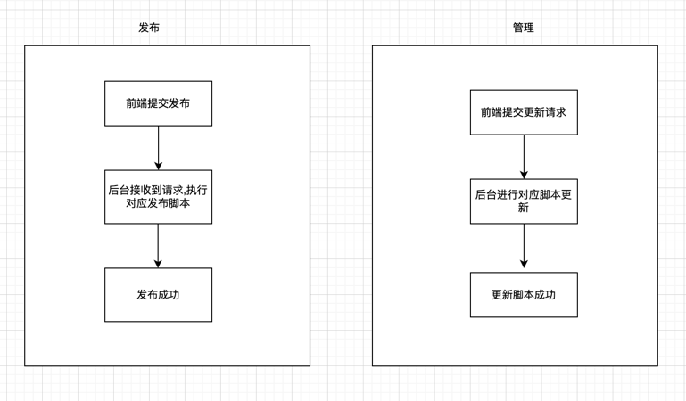

# 应用发布系统 

### 流程图

## 编译linux下运行文件命令
CGO_ENABLED=0 GOOS=linux GOARCH=amd64 go build
## 编译windows下运行文件命令
CGO_ENABLED=0 GOOS=windows GOARCH=amd64 go build

# 发布接口
## 地址:http://127.0.0.1:8002/publishProject
`参数: projectId,必传(1.东莞项目 2.城盾项目)`
`请求方式: POST`
`type: 必传,pc/app`
`file: 必传,文件流`